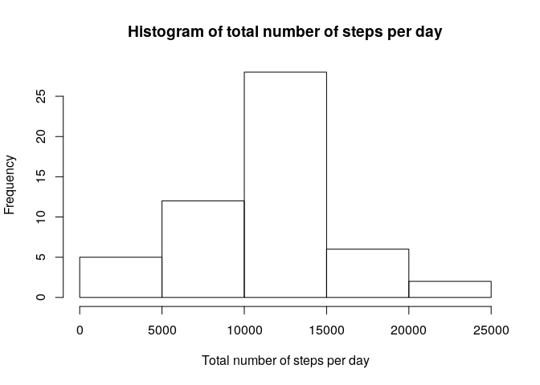

### Loading and preprocessing the data

1.Load the data

```r
unzip("activity.zip")
d_raw <- read.csv("activity.csv")
d <- d_raw[!(is.na(d_raw$steps)), ]
```

### What is mean total number of steps taken per day

1.Calculate the total number of steps taken per day

```r
total_per_day <- aggregate(steps ~ date, data = d, sum)
```

2.Make a histogram of the total number of steps taken each day

```r
hist(total_per_day$steps, main = "Histogram of total number of steps per day", 
      xlab = "Total number of steps per day")
```

<!-- -->

3.Calculate and report the mean and median of the total number of steps taken per day

The mean number of steps taken per day is 10766 and the median is 10765.

### What is the average daily activity pattern?

1.Make a time series plot of the 5-minute interval (x-axis) and the average number of steps taken, averaged across all days (y-axis)

```r
mean_by_interval <- aggregate(steps ~ interval, data = d, mean)
plot(mean_by_interval$interval, mean_by_interval$steps, type = "l", 
     main = "Time series plot of the average number of steps",
     xlab = "5 minute interval",
     ylab = "Average number of steps")
```

<!-- -->

5.Which 5-minute interval, on average across all the days in the dataset, contains the maximum number of steps?

The 5 minute interval that contains the maximum number of steps is the 835.

## Imputing missing values

1.Calculate and report the total number of missing values in the dataset

The total number of missing values is 2304.

2.Devise a strategy for filling in all of the missing values in the dataset. The strategy does not need to be sophisticated. For example, you could use the mean/median for that day, or the mean for that 5-minute interval, etc.

The missing values should be replaced with the mean value for interval.

3.Create a new dataset that is equal to the original dataset but with the missing data filled in


```r
d_imp <- d_raw
for (i in mean_by_interval$interval) {
    d_imp[d_imp$interval == i & is.na(d_imp$steps), ]$steps <- 
        mean_by_interval$steps[mean_by_interval$interval == i]
}
```

4.Make a histogram of the total number of steps taken each day and Calculate and report the mean and median total number of steps taken per day. Do these values differ from the estimates from the first part of the assignment? What is the impact of imputing missing data on the estimates of the total daily number of steps?


```r
total_per_day_imp <- aggregate(steps ~ date, data = d, sum)
hist(total_per_day_imp$steps, main = "Histogram of total number of steps per day imputing missing values", 
      xlab = "Total number of steps per day")
```

<!-- -->

The mean number of steps taken per day is 10766 and the median is 10765, which are the same values as for the dataset with na values removed, so imputing missing data has no impact at all.

### Are there differences in activity patterns between weekdays and weekends?

1.Create a new factor variable in the dataset with two levels – “weekday” and “weekend” indicating whether a given date is a weekday or weekend day.


```r
d_imp$day <- weekdays(as.Date(d_imp$date))
d_imp$week <- ""
d_imp[d_imp$day == "Samstag" | d_imp$day == "Sonntag", ]$week <- "weekend"
d_imp[!(d_imp$day == "Samstag" | d_imp$day == "Sonntag"), ]$week <- "weekday"
d_imp$week <- factor(d_imp$week)
```

2.Make a panel plot containing a time series plot of the 5-minute interval (x-axis) and the average number of steps taken, averaged across all weekday days or weekend days (y-axis). See the README file in the GitHub repository to see an example of what this plot should look like using simulated data.


```r
mean_by_interval_imp <- aggregate(steps ~ interval + week, data = d_imp, mean)
library(lattice)
xyplot(steps ~ interval | week, data = mean_by_interval_imp, type = "l", lwd = 2,
       layout = c(1, 2), 
       xlab = "5-minute interval", 
       ylab = "Average number of steps",
       main = "Average Number of Steps Taken (across all weekday days or weekend days)")
```

<!-- -->
